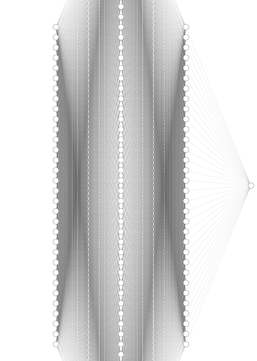

```{r setup, include=FALSE}
knitr::opts_chunk$set(echo = TRUE)
```

\newpage
=======
# Introduction 
Our team decided to analyze the Alzheimer’s Disease dataset created by Rabei El Kharoua on Kaggle. We decided to proceed with this topic since Alzheimer’s is a very common illness without a cure that affects millions of people both directly and indirectly. This data set includes data from 2,149 patients and has 34 variables. Through this analysis we wanted to answer the question: Which factors are strongly associated with the diagnosis of Alzheimer's Disease? 

## Dataset Information:
- Age: age of patients (60-90 years)\
- Gender: 0 if male or 1 if female\
- Ethnicity: 0 - Caucasian, 1 - African American, 2 - Asian, 3 - other\
- Education Level: 0 - None, 1 - High School, 2 - Bachelors, 3 - Higher\
- BMI: Body Mass Index (15 - 40)\
- Smoking: 0 - No, 1 - Yes\
- Physical Activity: Weekly physical activity (0 - 10 hrs)\
- DietQuality: Diet quality score (0 -10)\
- SleepQuality: Sleep quality score (4 - 10)\
- Health History Variables (Categorical: 0 - No, 1 - Yes): 
    - FamilyHistoryAlzheimers
    - CardiovascularDisease
    - Diabetes
    - Depression 
    - HeadInjury
    - Hypertension\
- MMSE: Mini-Mental State Examination score (0 -30); lower score indicates cognitive impairment\
- FunctionalAsssessment: (0 -10); lower score indicates greater impairment\
- MemoryComplaints: 0 - No, 1- Yes\
- BehavioralProblems: 0 - No, 1 - Yes\
- ADL: Activities of Daily Living score, (0 -10); lower score indicates greater impairment\
- Symptom Variables (Categorical: 0 - No, 1 - Yes): 
    - Confusion
    - Disorientation
    - PersonalityChanges 
    - DifficultyCompletingTasks
    - Forgetfulness\
- Diagnosis: Diagnosis Status for Alzheimer’s Disease; 0 - No, 1 - Yes

# Neural Network (Jake Schwartz, Sana Akhtar, Alina Bangash)

  First, let's examine our neural network model, which predicts whether a person has Alzheimer's based on various input variables. The model starts with 32 input features, which are processed through two hidden layers before reaching the output layer. Each connection between nodes has an associated weight, representing the importance of the input variables in making predictions as they pass through the hidden layers. Additionally, each node includes a bias term, a constant value that helps adjust the output along with the weighted input, improving the model's accuracy and flexibility. 
  
  
  
  The model employs the ReLU activation function, which enhances the efficiency of training and the overall performance of neural networks, particularly when dealing with non-linear data. ReLU introduces non-linearity by allowing positive values to pass through unchanged while setting negative values to zero. This not only accelerates the convergence of the training process but also helps mitigate the vanishing gradient problem, a common issue in deep networks. The ReLU improves the network's ability to learn complex patterns and relationships within the data.

```{r, echo=FALSE, fig.align='center'}
knitr::include_graphics("ReLu.png")
```


The neural network model uses Binary Cross Entropy with Logits (BCE with Logits) to measure the loss between the predicted probabilities and the true labels. This function first applies a sigmoid activation to the raw, unnormalized outputs (logits) to convert them into probabilities. By combining the sigmoid function and BCE in a single step, BCE with Logits provides greater numerical stability compared to applying a sigmoid function followed by a separate BCE loss calculation. This approach ensures more reliable training, especially in neural networks 


```{r, echo=FALSE, fig.align='center'}
knitr::include_graphics("sigmoid.png")
```

Using the PyTorch library in R, we created our neural network model with the nn_module, defining the specifics of the layers and functions. The complete neural network architecture designed to predict Alzheimer's in patients includes an input layer with 32 nodes, a first hidden layer with 64 nodes, a second hidden layer with 32 nodes, and an output layer with a single node that produces a binary output (Yes or No). This structure allows the model to effectively learn from the input features and make accurate predictions.


```{r eval=FALSE}
library(torch)

alzheimers_net = nn_module(
  "class_net",
  
  initialize = function(){
    self$layer1 = nn_linear(in_features = ncol(x), out_features = 64)
    self$layer2 = nn_linear(in_features = 64, out_features = 32)
    self$output = nn_linear(in_features = 32, out_features = 1)
  },
  forward = function(x){
    x %>%
      self$layer1() %>%
      nnf_relu() %>%
      self$layer2() %>%
      nnf_relu() %>%
      self$output()
  }
)
```


We evaluated the neural network model using a 10-fold cross-validation procedure, with each iteration consisting of 200 epochs. During the cross-validation, as the number of epochs approached 200, the loss consistently decreased, indicating effective learning. Utilizing the ReLU activation function and the BCE with Logits loss function, we achieved a final loss of 0.90%. This comprehensive evaluation resulted in a cross-validation classification accuracy of 98.37% and an error rate of 1.63%, demonstrating the model's strong predictive performance for identifying Alzheimer's in patients 


```{r eval=FALSE}
# Sample code loop: 
library(caret)
k <- 10
folds <- createFolds(y, k = k, list = TRUE, returnTrain = TRUE)
all_losses <- list()
result <- numeric(k)
for (i in 1:k) {
  cat("Fold:", i, "\n")
  # Split the data
  # Initialize the model
  # Training loop
  num_epochs <- 200
  for (epoch in 1:num_epochs) {
    #Step through network
  }
  # Evaluate the model
  neural_model$eval()
  with_no_grad({
    outputs <- neural_model(x_test)
    predictions <- torch_sigmoid(outputs) > 0.5
    accuracy <- mean(as_array(predictions) == as_array(y_test))
    result[i] <- accuracy
  })
}
```


Next, we visualized the loss for each training fold and epoch. We observed that around the 200th epoch, the loss began to plateau, indicating that additional training did not significantly reduce the loss further. Overall, the model demonstrated strong accuracy in predicting whether a person has Alzheimer's, showcasing its effectiveness and reliability for this classification task.

```{r, echo=FALSE, fig.align='center'}
knitr::include_graphics("Epoch_training_loss.png")
```
We chose to start with a Neural Network to 

# Decision Tree:

## Model Formula: 

# Conclusion: 


